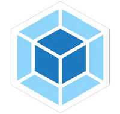
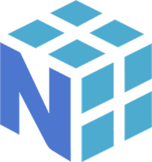
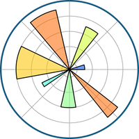
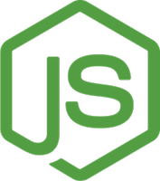

    <h1>
        Hi! Welcome to my Profile! I'm Aaron
        
    </h1>
    
I am a self-taught frontend developer and 3D artist with backgraound styudies in phyisics.

 

    

## Favorite tools, I feel comfortable working with:
### Programming languages

        &nbsp;
        &nbsp;
        &nbsp;

### Markup and Styling languages

        &nbsp;
        &nbsp;

### Frameworks and Libraries

        &nbsp; &nbsp;
        &nbsp;
        &nbsp;&nbsp;&nbsp;&nbsp;

### Software and Tools

        &nbsp;
        &nbsp;
        &nbsp;
        &nbsp;
        &nbsp;
        &nbsp;

### Databases and Query Languages

        &nbsp;

### Currently Learning

        &nbsp;
        &nbsp;
        &nbsp;
        &nbsp;&nbsp;&nbsp;&nbsp;
        &nbsp;&nbsp;&nbsp;&nbsp;
        &nbsp;&nbsp;&nbsp;&nbsp;
        &nbsp;&nbsp;&nbsp;&nbsp;
        &nbsp;&nbsp;&nbsp;&nbsp;
        

### To learn later

        &nbsp;
        &nbsp;
        &nbsp;

## Some of My Repos
### My latest 5 Front-end Projects

Other interesting projects: [Calculator](https://github.com/iaaron-xyz/calculator), [restaurant page](https://github.com/iaaron-xyz/restaurant-page) and [Rock paper and Scissors](https://github.com/iaaron-xyz/rock-paper-scissors).

### CS50 Harvard courses

## :fire: Streak stats

  

## Most Used Languages

